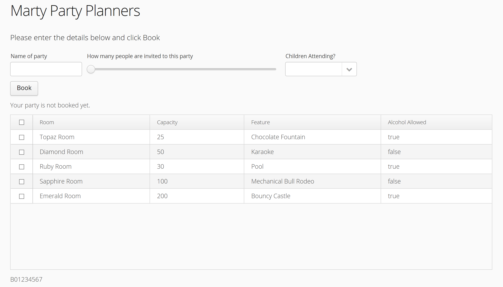

# COM673 Sample Assessment
*Read all the instructions below and all the questions before attempting the solution*

### Instructions
* This is a 3 hour, open book assessment
    * You may use any non-human resources, online or offline, to help you
* You may **not** communicate (in person or digitally) with any other student or person, except the invigilator 
* Do not write your name anywhere in the source code you submit
    * Use your student number to identify yourself e.g. B01234567
* There are no penalties for asking a question, please clarify any questions you have
* Read the entire question before beginning

### Problem Description
A local company, Marty Party Planners, has hired you to make a web app to handle their party room booking system.
Currently, party organisers ring them up and an operator has to describe each room to the caller and make the booking if they find a room suitable for their party. They want a webapp where the user can see the rooms available and specify the rooms they want to book.

The party room names are *Topaz Room, Diamond Room, Ruby Room, Sapphire Room* and *Emerald Room*. Each room has a special feature like a pool or bouncy castle.  
Some rooms serve alcohol (kids parties are not allowed in these rooms). There is no middle ground on alcohol serving, it is either served in the room or not. This is part of their alcohol licensing requirements. 

The logo an instructions for the app have been supplied in HTML from the client:
```html
<H1>Marty Party Planners</H1> <p/> <h3>Please enter the details below and click Book</h3>
```
Room details:
'Topaz Room' holds 25 people, serves alcohol, and has a Chocolate Fountain  
'Diamond Room' holds 50 people, does not serve alcohol, and has 'Karaoke'  
'Ruby Room' holds 30 people, serves alcohol, and has a 'Pool'  
'Sapphire Room' holds 100 people, does not serve alcohol, and has a 'Mechanical Bull Rodeo'  
'Emerald Room' holds 200 people, serves alcohol, and has a 'Bouncy Castle'  

Conditions of booking:
* Each party must have a name
* Each party must specify how many people attending (min 10, max 300)
* Each party must specify if any children attending
* There are several messages the user can receive. They are given below in each case (in HTML)
```html
Initially, it should show:
Your party is not booked yet

Once Book button has been clicked: 
If the user does not select at least one room:
<strong>Please select at least one room!</strong>

If a party is booked without a name, the user should be presented with: 
<strong>Please enter party name.</strong>

If the user does not specify if children are attending
<strong>Please confirm if children attending your party</strong>

If they specify children are attending but have selected a room with alcohol
<strong>You cannot select any rooms serving alcohol if children are attending.</strong>

If the specify a number of people greater than the total capacity of all the rooms selected
<strong>You have selected rooms with a max capacity of 100 which is not enough to hold 300.</strong>

If they have not made any of the above mistakes:
<h3>Success! The party is booked now</h3>
   ```
### UI Design
The client has asked that the UI be laid out as follows:  
* logo and instructions (supplied above) at the top
* user input horizontally as follows:
   * name of party, slider for how many people (slider should be **set** to **500 PIXEL**s in **width**), combo box with yes/no for children
   * please refer to the design image for exact captions of all components
* A Book button underneath (vertically) the horizontal components
* A label should be underneath showing the HTML messages listed above (initially: Your party is not booked yet)
* A Grid showing the party rooms available, the grid should be multi-selectable and the full width of the page
* A label underneath the grid with your student number

Test a finished solution: [b01234567-exam.azurewebsites.net/](https://b01234567-exam.azurewebsites.net/) 
  


### Submission Guide
**If you can't get something working, submit / upload your attempt anyway.
Don't spend too long on any one issue, move on to something else and come back to it later.**
1. Submission is on GitHub.
2. Drag & Drop or Stage / Push using VS Code but whichever you do ensure you **Commit to Master Branch** (at the bottom of the GitHub window when uploading.
3. At assessment due date, the files uploaded are locked for the submission (don't edit the files after that date, as it will email me each time and we can only grade the Commit at time of assessment end) 
#### Upload & Commit: 
1. The entrie Vaadin project
2. The SQL schema you used to create and populate the database (just save the Create Table and Insert SQL statements to a text file called Schemal.sql). Note: It is OK to use a web tool to generate the SQL if you wish.  


### Marking Scheme
1. Create a new Azure Web app called your student number-exam e.g. "B01234567-exam.azurewebsites.net". Create a new App Service Plan for your web app with the B01234567-exam in North Europe on the Free pricing tier  **(5 marks)**
1. Configure the app for Java and Jetty **(5 marks)**
1. Create a SQL database called **B01234567-exam** on the Basic pricing tier in the same resource group **(5 marks)**
1. Populate the database table based on the data above with rows of sample data (as given above) **(10 marks)**
1. Create a Vaadin app with the following features:
    1. Uses the groupID **ie.ulster.exam**
    2. Connects to and loads the data from the Azure database **(5 marks)**
    3. Converts the data from a resultset to a List of objects **(5 marks)**
    4. Creates the UI items listed above (marks for adding them and marks for getting each aspect asked in the question implemented) **(25 marks)**
    5. Adds the calculation functionality so that it correctly prompts the user to fix what they need to **(10 marks)** and then correctly calculates the remaining requirements and shows it as directed **(10 marks)**
    6. Neatness, bracket formatting, code quality, meaningful comments and readability **(10 marks)** 
1. Deploy the app on Azure (you can use FTP or any other way to upload the .war file) **(10 marks)**
